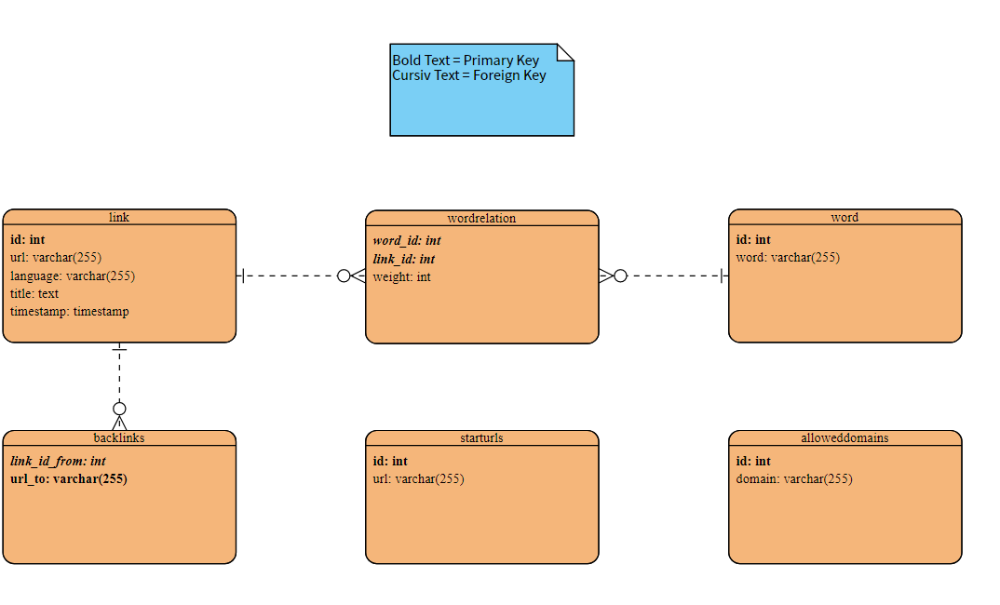

# Search_Engine_DB
This is a small project to recreate a small scale search engine using python.

We scrape each website in a starturl database for links to other websites. And
recursivly search them aswell. The scraping process is limited to allowed Domains in 
another database which can all be customized inside a streamlit website.

The Project is structured as follows:
1. DB => This contains the Connection, Disconnection, Creation of Tables and all Interfaces for Reads, Writes and Updates aswell as Constraints and  the necessary formatting
2. Scraper => This contains the scraper, which uses the DB Interface to write and read the results in the Database. We used language recognition, lemmatization, Stop-Word-Elimination,ngram-parsing, TFIDF Document Ranking and Backlinking to improve the search results.
3. Website => This contains a frontend with admin and user sites. The user site is the search engine itself which allows search for words and part of words. It returns a certain number of the most relevant websites based on the scraper Results

# Databasse Structure
We use MySQL with the following structure:

This is a simplified Version of our Database structure. If you want
to know everything (like constraints and automatic updates) please refer to the code of the constructor in "DB/Database.py".

# Run the Application
You can deploy this application with the following steps:

1. Create a .env in the "DB"-Folder with the following scheme:

| Key      | Value |
| ----------- | ----------- |
| user      | "Username"       |
| password   | "Password"        |
| host      | "127.0.0.1"       |
| port   | 3306        |
| database      | "Databasename"       |

1. Run Docker Compose on the docker-compose-db.yaml, this creates the mysql-database with the right tables, constraints and so on and a phpmyadmin interface
2. Run Docker Compose on the docker-compose-spider.yaml to run the scraper which fills the database
3. Run Docker Compose on the docker-compose-website.yaml to run the frontend with admin and user interface
